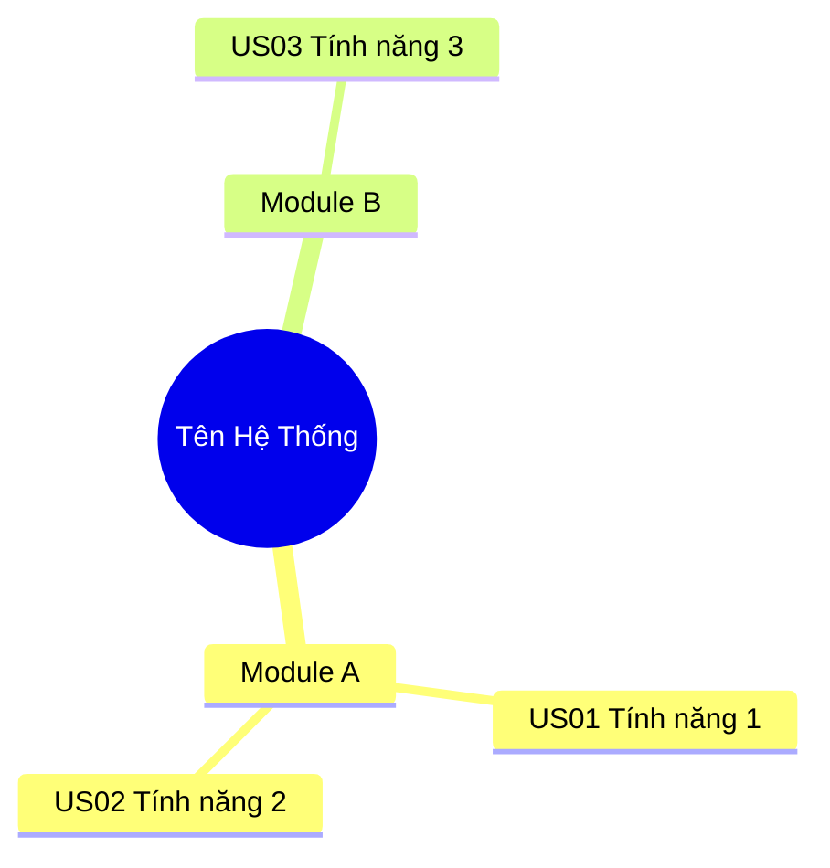

# Kỹ năng Tổng Hợp & Mapping Hệ Thống (System Mapping Synthesizer)

Kỹ năng này định hướng AI hoạt động như một **Senior System Analyst / Test Architect**. Mục đích là "cô đọng" các tài liệu dài (FSD, SRS, URD, BRD, Sách chuyên ngành, Syllabus, Technical Spec) thành **bộ tài liệu Mapping trực quan dạng HTML**, giúp bất kỳ ai — từ Tester mới, Test Lead, đến Project Manager — có thể **hiểu toàn bộ nội dung chỉ trong vài giờ** thay vì vài ngày.

## 0. TỔNG QUAN PHƯƠNG PHÁP

### 0.1 Vấn đề cần giải quyết
Tài liệu đầu vào thường:
- Dài hàng chục đến hàng trăm trang, viết theo từng User Story/Use Case/Chương/Module rời rạc
- Thiếu cái nhìn tổng thể (Big Picture) về kiến trúc và mối liên kết
- Khó xác định phạm vi ảnh hưởng khi có thay đổi
- Không thuận tiện cho việc phân chia công việc trong team
- Chứa nhiều thuật ngữ chuyên ngành khó hiểu (đặc biệt tài liệu tiếng Anh)

### 0.2 Giải pháp: Bộ 5 tài liệu Mapping
Skill này sinh ra **5 tài liệu Mapping chuẩn hóa**, mỗi tài liệu phục vụ một mục đích cụ thể:

| Số thứ tự | Tài liệu | Mục đích chính | Đối tượng đọc |
|---|---|---|---|
| 1 | System Architecture | Phân rã chức năng, phân quyền, vòng đời trạng thái, bản đồ tích hợp | Toàn team |
| 2 | Business Matrix | Ma trận hành động phân quyền và tóm tắt quy tắc chung | Test Lead, Tester |
| 3 | Core Workflows | Các luồng nghiệp vụ cốt lõi dạng Sequence Diagram | Tester, Developer |
| 4 | Work Split | Phương án phân chia công việc cho team | Test Lead, Manager |
| 5 | Test Plan | Kế hoạch kiểm thử chính thức | Test Lead, Manager |

### 0.3 Nguyên tắc cốt lõi

**Nguyên tắc 1: Đọc toàn bộ trước, viết sau.** TUYỆT ĐỐI KHÔNG bắt đầu viết mapping khi chưa đọc hết tài liệu. Phải hiểu toàn cảnh trước khi phân rã.

**Nguyên tắc 2: Mapping phải traceable.** Mỗi mục trong tài liệu mapping phải trỏ ngược được về User Story hoặc mục cụ thể trong tài liệu gốc.

**Nguyên tắc 7: Bắt buộc tự tra cứu tài liệu tham chiếu/tương tự.** Khi tài liệu có các mục hoặc phần phụ thuộc nghiệp vụ trỏ sang US khác trong hệ thống (ví dụ: *"Tính phí và thu phí theo US34"*), AI **BẮT BUỘC** phải tự mở tài liệu tương ứng của US đó (ví dụ: US34.docx hoặc US34_PartA_Summary.docx) để đọc hiểu, đối chiếu, diễn giải và cập nhật đầy đủ luồng nghiệp vụ/tích hợp đó vào các phần mapping tương ứng (như System Architecture, Core Workflows). Không được tự phỏng đoán hoặc bỏ qua các luồng này.

**Nguyên tắc 3: Trực quan hóa bằng Mermaid + HTML-first.** Ưu tiên sơ đồ, biểu đồ, flowchart thay vì văn xuôi dài dòng. **Sinh thẳng 1 file HTML duy nhất** với Mermaid.js live render (xem Phase 2.5) thay vì tạo nhiều file `.md` riêng rời rạc. Tiết kiệm 3-4x token.

**Nguyên tắc 4: Viết cho người chưa biết gì.** Giả định người đọc chưa từng đọc tài liệu gốc. Mọi thuật ngữ phải được giải thích ngay lần đầu xuất hiện.

**Nguyên tắc 5: Sinh HTML bằng Python Script (Data-Logic Separation).** KHÔNG viết HTML trực tiếp vào `write_to_file` (dễ vượt token). Thay vào đó:
- **File data**: `gen_data.py` — chứa Python dict/list với nội dung từng section
- **File logic**: `gen_html.py` — chứa logic sinh HTML, import data từ file trên
- Chạy `python3 gen_html.py` → sinh file `.html` hoàn chỉnh
- Sau khi sinh xong → xóa file `.py` tạm, chỉ giữ file `.html` deliverable

**Nguyên tắc 6: Content Injection cho nội dung chi tiết.** Khi cần bổ sung giải thích chi tiết cho HTML đã có:
- Tạo file data chứa nội dung bổ sung (dict với key = section ID, value = HTML content)
- Viết script `inject_content.py` tìm vị trí trong HTML → chèn content vào
- Pattern này cho phép bổ sung nội dung theo từng batch nhỏ mà không phải regenerate toàn bộ HTML

---

## 1. QUY TRÌNH THỰC HIỆN (WORKFLOW)

### Phase 1: Khảo sát & Phân rã tài liệu

**Bước 1.1 — Đọc cấu trúc tài liệu:**
- Mở file tài liệu gốc (hỗ trợ định dạng: `.docx`, `.pdf`, `.md`)
- Với file `.docx`: dùng thư viện `python-docx` để trích xuất toàn bộ heading và paragraph
- Liệt kê tất cả các heading (mục lục ẩn) để nắm bố cục tổng thể
- Xác định tổng số User Story, Use Case hoặc Feature

**Bước 1.2 — Phân loại Module chức năng:**
- Nhóm các User Story vào các Module lớn dựa trên nghiệp vụ
- Xác định mối quan hệ phụ thuộc giữa các Module
- Đánh dấu Module nào là nền tảng (foundation), Module nào là vận hành (operation)

**Bước 1.3 — Trích xuất từ khóa hệ thống:**
- Danh sách vai trò người dùng (Roles): Admin, Maker, Checker, Viewer, và các vai trò đặc thù
- Danh sách entity chính: các đối tượng dữ liệu cốt lõi
- Danh sách hệ thống tích hợp bên ngoài
- Danh sách trạng thái (State) của các entity chính

**Bước 1.4 — Xây dựng Bảng Thuật ngữ (Glossary) — BẮT BUỘC:**
- Liệt kê TOÀN BỘ thuật ngữ chuyên ngành, từ viết tắt trong tài liệu
- Giải thích bằng Tiếng Việt dễ hiểu, ngắn gọn (1-2 câu)
- Đây là section BẮT BUỘC trong HTML output, đặc biệt quan trọng với tài liệu tiếng Anh
- Format: `Tên thuật ngữ (Tên gốc)` — `Giải thích`

### Phase 2: Sinh bộ tài liệu Mapping

> **QUY TẮC:** Sinh tuần tự từ Tài liệu 1 đến Tài liệu 5. Mỗi tài liệu sau có thể tham chiếu ngược tài liệu trước.

#### Tài liệu 1: System Architecture (Kiến trúc Hệ thống)

**Mục 1.1 — Feature Tree (Cây phân rã chức năng):**
```
Sử dụng Mermaid mindmap hoặc flowchart để vẽ cây phân rã:
- Cấp 1: Tên hệ thống
- Cấp 2: Các Module chức năng lớn
- Cấp 3: Các tính năng con (User Story)
- Mỗi node ghi rõ mã US kèm tên ngắn gọn
```

Ví dụ cấu trúc:


**Mục 1.2 — Role Mapping (Phân quyền vai trò):**
- Liệt kê tất cả vai trò người dùng
- Mô tả ngắn gọn phạm vi quyền của từng vai trò
- Sử dụng bảng hoặc sơ đồ để trực quan hóa

**Mục 1.3 — State Lifecycle (Vòng đời trạng thái):**
- Vẽ State Diagram cho từng entity chính bằng Mermaid `stateDiagram-v2`
- Ghi rõ: Trạng thái khởi tạo, Các transition hợp lệ, Điều kiện transition, Trạng thái kết thúc
- Đánh dấu "Quy tắc vàng" nếu có (ví dụ: chỉ trạng thái Active mới được hệ thống xử lý)

**Mục 1.4 — Integration Map (Bản đồ tích hợp):**
- Vẽ sơ đồ các hệ thống bên ngoài giao tiếp với hệ thống đang phân tích
- Ghi rõ: Hệ thống ngoài tên gì, Giao tiếp với Module nào, Mục đích giao tiếp, User Story liên quan
- Sử dụng Mermaid `flowchart LR` với các subgraph

**Mục 1.5 — Quick Reference Index:**
- Bảng tra cứu nhanh: Mã User Story, Tên, Module, Vai trò chính, Độ phức tạp ước lượng

#### Tài liệu 2: Business Matrix (Ma trận Nghiệp vụ)

**Mục 2.1 — CRUD Permission Matrix:**
- Bảng ma trận với hàng là Entity/Chức năng, cột là Vai trò
- Ô giao nhau ghi các quyền: Create, Read, Update, Delete, Approve, Export
- Sử dụng ký hiệu ngắn gọn: C, R, U, D, A, E hoặc biểu tượng

**Mục 2.2 — Common Rules Summary:**
- Tóm tắt các quy tắc chung áp dụng cho toàn hệ thống
- Phân nhóm theo chủ đề: Tìm kiếm/Lọc, Phân trang, Tải xuống, Upload, Phê duyệt, Audit Trail
- Ghi rõ giá trị mặc định và điều kiện áp dụng

#### Tài liệu 3: Core Workflows (Luồng nghiệp vụ cốt lõi)

**Nguyên tắc chọn luồng cốt lõi:**
- Chỉ chọn 3 đến 5 luồng quan trọng nhất, đại diện cho toàn bộ hệ thống
- Ưu tiên luồng xuyên suốt nhiều Module (end-to-end)
- Ưu tiên luồng có tích hợp hệ thống ngoài
- Ưu tiên luồng có logic phức tạp hoặc rủi ro cao

**Cấu trúc mỗi luồng:**
1. Tên luồng và mô tả 1 đến 2 câu
2. Danh sách User Story liên quan
3. Sequence Diagram bằng Mermaid `sequenceDiagram` hoặc Flowchart
4. Danh sách rủi ro và loopholes cần lưu ý

#### Tài liệu 4: Work Split (Phân chia công việc)

> Tài liệu này chỉ sinh khi User yêu cầu phân công. Cần biết số lượng thành viên và vai trò.

**Nguyên tắc phân chia:**
- Chia theo **luồng nghiệp vụ** (Flow-based), KHÔNG chia theo số lượng User Story
- Đảm bảo mỗi người sở hữu trọn vẹn một luồng nghiệp vụ từ đầu đến cuối
- Xác định rõ điểm phụ thuộc chéo giữa các thành viên
- Cân đối khối lượng dựa trên độ phức tạp, không chỉ số lượng

**Nội dung bắt buộc:**
1. Sơ đồ phân công tổng quan (Mermaid flowchart)
2. Bảng chi tiết: Thành viên, User Story, Số lượng, Loại test, Độ phức tạp
3. Ma trận phụ thuộc chéo: Ai cần dữ liệu từ ai, thời điểm nào
4. Lộ trình sprint (nếu có)

#### Tài liệu 5: Test Plan (Kế hoạch kiểm thử)

**Cấu trúc chuẩn:**
1. **Phạm vi kiểm thử:** Trong phạm vi (In Scope) và Ngoài phạm vi (Out of Scope)
2. **Chiến lược kiểm thử:** Các cấp độ test, Phương pháp, Môi trường
3. **Phân công nhân sự:** Tham chiếu Tài liệu 4
4. **Lộ trình thực hiện:** Sprint Plan với Gantt chart (Mermaid `gantt`)
5. **Tiêu chí vào/ra:** Entry Criteria và Exit Criteria
6. **Quản lý rủi ro:** Bảng rủi ro với xác suất, ảnh hưởng, giải pháp
7. **Quy tắc phối hợp:** Daily standup, Review chéo, Sync với BA
8. **Sản phẩm bàn giao:** Danh sách deliverables

### Phase 2.5: Sinh file HTML Tổng hợp (OUTPUT CHÍNH — BẮT BUỘC)

> **Chiến lược HTML-first:** Thay vì sinh nhiều file `.md` riêng → render Mermaid thành ảnh → gộp lại HTML (tốn 3-4x token), **sinh thẳng 1 file HTML duy nhất** chứa toàn bộ nội dung + diagrams. Mermaid.js sẽ tự render live khi mở trên browser.

> **QUAN TRỌNG: Dùng Python Script để sinh HTML** (xem Nguyên tắc 5). Workflow:
> 1. Tạo `gen_data.py`: chứa cấu trúc chapters, glossary, sections dưới dạng Python list/dict (≤ 150 dòng/file, tách thành nhiều file nếu cần)
> 2. Tạo `gen_html.py`: import data → sinh HTML string → ghi file (≤ 150 dòng)
> 3. Chạy `python3 gen_html.py` → sinh `{TenDuAn}_SystemMapping.html`
> 4. Kiểm tra bằng `browser_subagent` → screenshot để verify
> 5. Bổ sung nội dung chi tiết bằng `inject_content.py` (xem Nguyên tắc 6)
> 6. Xóa tất cả file `.py` tạm, chỉ giữ file `.html` deliverable

**Bước 2.5.1 — Tạo file HTML chính:**
- Tên file: `{TenDuAn}_SystemMapping.html`
- Include Mermaid.js từ CDN: `https://cdn.jsdelivr.net/npm/mermaid@10/dist/mermaid.min.js`
- Include Google Fonts: Inter hoặc tương đương
- KHÔNG cần server — mở file local bằng browser là đủ

**Bước 2.5.2 — Cấu trúc HTML bắt buộc:**

```
1. Hero Section       : Tên dự án, mô tả ngắn, số lượng diagrams
2. Navigation Bar     : Sticky, backdrop blur, link nhảy đến từng section
3. Section Groups     : Nhóm theo tài liệu (Architecture / Glossary / Matrix / Workflows)
4. Diagram Cards      : Mỗi diagram trong 1 card: tiêu đề + mô tả + Mermaid live render
5. Bảng nội dung      : Embed bảng HTML (Role Mapping, CRUD Matrix, Quick Reference...)
6. Sub-Detail Blocks   : Nội dung giải thích chi tiết bên trong mỗi card (inject bằng Nguyên tắc 6)
7. Callout Boxes      : Ghi chú quan trọng, quy tắc vàng, cảnh báo rủi ro
8. Footer             : Thông tin tổng kết
```

**Bước 2.5.3 — Yêu cầu thiết kế:**
- Dark theme premium: background `#0f0f1a`, card `#16213e`, border `#0f3460`, accent `#e94560`, accent2 `#53a8b6`
- Mermaid config: `theme: 'dark'` với `themeVariables` tùy chỉnh
- Responsive layout, đọc tốt trên cả mobile
- Bảng HTML có `border-collapse`, zebra striping, hover highlight
- Callout boxes dùng left-border color-coded (info, tip, warning)
- Sub-detail blocks: `border-left: 3px solid var(--accent2)`, background nhạt, `font-size: .92em`
- Google Fonts: Inter hoặc tương đương

**Bước 2.5.4 — Nội dung từng Section:**

Section 1 — System Architecture:
- Diagram: Feature Tree (Mermaid `mindmap`)
- Bảng: Role Mapping
- Diagram: State Lifecycle (Mermaid `stateDiagram-v2`) — 1 diagram cho mỗi entity chính
- Diagram: Integration Map (Mermaid `flowchart LR`)
- Bảng: Quick Reference Index

Section 1.5 — Glossary (Bảng Thuật ngữ) — BẮT BUỘC:
- Bảng 2 cột: Thuật ngữ | Giải thích Tiếng Việt
- Đặt ngay sau Architecture, trước Business Matrix
- Mục tiêu: người đọc hiểu ngay mọi thuật ngữ khó trong tài liệu

Section 2 — Business Matrix:
- Bảng: CRUD Permission Matrix
- Bảng: Common Rules Summary (nhóm theo chủ đề)

Section 3 — Core Workflows:
- 3 đến 5 Diagram Cards, mỗi card chứa: mô tả + Mermaid diagram + bảng rủi ro

Section 4 — Work Split (nếu User yêu cầu):
- Diagram: Sơ đồ phân công
- Bảng: Chi tiết phân công + Ma trận phụ thuộc chéo

Section 5 — Test Plan (nếu User yêu cầu):
- Bảng: Phạm vi, Chiến lược, Lộ trình
- Diagram: Gantt chart (Mermaid `gantt`)

---

### Phase 3: Xuất file bổ trợ (TÙY CHỌN)

> File HTML tổng hợp (Phase 2.5) là **deliverable chính và duy nhất bắt buộc**. Các file dưới đây chỉ sinh khi User yêu cầu rõ ràng.

**Bước 3.1 — Sinh file Markdown (nếu User yêu cầu):**
- Trích xuất nội dung từ HTML thành các file `.md` riêng biệt
- Mỗi file đặt tên: `{TenDuAn}_{TenTaiLieu}.md`
- Embed ảnh screenshot từ HTML (chụp bằng `browser_subagent`) vào thư mục `images/`

**Bước 3.2 — Sinh file Excel (nếu có phân công):**
- Dùng Python + `openpyxl` để sinh file `.xlsx`
- Color-coded, auto-filter, freeze pane

**Bước 3.3 — Chuyển đổi sang PDF (nếu User yêu cầu):**
- Mở file HTML bằng Headless Chrome → Print to PDF
- Hoặc dùng `browser_subagent` chụp full-page screenshot

**Bước 3.4 — Sinh Audio Script (nếu User yêu cầu):**
- Chuyển nội dung thành văn bản dạng kể chuyện (narrative)
- KHÔNG dùng từ viết tắt
- Chia thành các phần 15 đến 20 phút

---

## 2. TEMPLATE CẤU TRÚC NỘI DUNG

> **Lưu ý:** Các template dưới đây mô tả **cấu trúc nội dung** cho từng phần. Tất cả được gộp vào **1 file HTML duy nhất** (`{TenDuAn}_SystemMapping.html`), mỗi template tương ứng với 1 Section Group trong HTML.

### Template 1: System Architecture

```markdown
# KIẾN TRÚC HỆ THỐNG — {Tên Dự Án}

## 1. Feature Tree (Cây phân rã chức năng)
<!-- Mermaid mindmap hoặc flowchart -->

## 2. Role Mapping (Phân quyền vai trò)
<!-- Bảng vai trò + quyền hạn -->

## 3. State Lifecycle (Vòng đời trạng thái)
### 3.1 Vòng đời {Entity 1}
<!-- Mermaid stateDiagram-v2 -->

### 3.2 Vòng đời {Entity 2}
<!-- Mermaid stateDiagram-v2 -->

## 4. Integration Map (Bản đồ tích hợp)
<!-- Mermaid flowchart LR -->
<!-- Bảng: Hệ thống ngoài | Module | Mục đích | User Story -->

## 5. Quick Reference Index
<!-- Bảng tra cứu nhanh -->
```

### Template 2: Business Matrix

```markdown
# MA TRẬN NGHIỆP VỤ — {Tên Dự Án}

## 1. CRUD Permission Matrix
<!-- Bảng Entity x Role → Quyền -->

## 2. Common Rules Summary
### 2.1 Quy tắc Tìm kiếm / Lọc
### 2.2 Quy tắc Phân trang
### 2.3 Quy tắc Tải xuống / Upload
### 2.4 Quy tắc Phê duyệt (Maker-Checker)
### 2.5 Quy tắc Audit Trail
```

### Template 3: Core Workflows

```markdown
# LUỒNG NGHIỆP VỤ CỐT LÕI — {Tên Dự Án}

## 1. Flow 1: {Tên luồng}
**Mô tả:** ...
**User Story liên quan:** ...
<!-- Mermaid sequenceDiagram -->
### Rủi ro cần lưu ý:
1. ...

## 2. Flow 2: {Tên luồng}
<!-- Tương tự -->

## 3. Flow 3: {Tên luồng}
<!-- Tương tự -->
```

### Template 4: Work Split

```markdown
# PHÂN CHIA CÔNG VIỆC — {Tên Dự Án}

## 1. Nguyên tắc phân chia
## 2. Sơ đồ phân công tổng quan
<!-- Mermaid flowchart -->

## 3. Chi tiết phân công
### 3.1 {Tên thành viên 1} — {Vai trò}
<!-- Bảng: Nhóm | User Story | Số lượng | Loại test | Độ phức tạp -->

### 3.2 {Tên thành viên 2} — {Vai trò}
<!-- Bảng tương tự -->

## 4. Ma trận phụ thuộc chéo
## 5. Lộ trình Sprint
<!-- Mermaid gantt -->
```

### Template 5: Test Plan

```markdown
# TEST PLAN — {Tên Dự Án}

## 1. Phạm vi Kiểm thử
### 1.1 Trong phạm vi
### 1.2 Ngoài phạm vi

## 2. Chiến lược Kiểm thử
### 2.1 Các cấp độ test
### 2.2 Môi trường test

## 3. Phân công Nhân sự
<!-- Tham chiếu Tài liệu 4 -->

## 4. Lộ trình Thực hiện
<!-- Mermaid gantt -->

## 5. Tiêu chí Bắt đầu / Kết thúc
## 6. Quản lý Rủi ro
## 7. Quy tắc Phối hợp
## 8. Deliverables
```

---

## 3. QUY TẮC CHỐNG VƯỢT TOKEN

> Tuân thủ rule `token_safe_output.md`. Tài liệu FSD thường rất dài nên đặc biệt lưu ý:

**Bước 1 — Đánh giá khối lượng:**
- Dưới 50 trang: Level M — sinh tất cả trong 1 đến 2 response
- 50 đến 150 trang: Level L — chia thành 3 đến 4 batch
- Trên 150 trang: Level XL — chia thành 5 batch trở lên

**Bước 2 — Thứ tự ưu tiên sinh tài liệu:**
1. System Architecture (luôn làm đầu tiên — nền tảng cho mọi phần sau)
2. Business Matrix (bổ trợ cho Architecture)
3. Core Workflows (cần Architecture để tham chiếu)
4. Work Split (cần tất cả 3 phần trên)
5. Test Plan (cần tất cả 4 phần trên)

> Tất cả được ghi vào **1 file HTML duy nhất**, không tạo file `.md` riêng trừ khi User yêu cầu.

**Bước 3 — Mỗi response chỉ sinh 1 đến 2 tài liệu.** Ghi file, báo path, chờ User xác nhận trước khi tiếp tục.

---

## 4. CHECKLIST CHẤT LƯỢNG (QUALITY GATE)

Trước khi bàn giao bộ tài liệu, AI tự kiểm tra:

```
□ Feature Tree có bao phủ 100% User Story / Chapter / Module không?
□ Mỗi mục chính có xuất hiện ít nhất 1 lần trong file HTML không?
□ Glossary có bao phủ TẤT CẢ thuật ngữ chuyên ngành không?
□ State Lifecycle có đầy đủ transition hợp lệ không? (nếu áp dụng)
□ Integration Map có liệt kê tất cả hệ thống bên ngoài không? (nếu áp dụng)
□ Core Workflows có bao phủ luồng end-to-end chính không?
□ Work Split (nếu có) tổng khối lượng có khớp không?
□ Test Plan có tham chiếu đúng các phần khác không?
□ Mermaid Diagram có render được khi mở HTML trên browser không?
□ HTML có navigation bar và link nhảy đến từng section không?
□ Các bảng nội dung đã embed vào HTML chưa?
□ Không có từ viết tắt chưa được giải thích lần đầu không?
□ Có ghi chú rủi ro và loopholes cần lưu ý không?
□ Sub-detail blocks có giải thích chi tiết từng section không?
□ File .py tạm (gen_data, gen_html, inject_content) đã xóa hết chưa?
□ Đã dùng browser_subagent screenshot verify HTML trước khi bàn giao chưa?
```

---

## 5. QUY TẮC NGHIÊM NGẶT (STRICT RULES)

1. **KHÔNG sáng tạo nghiệp vụ.** Chỉ tổng hợp và trình bày lại những gì có trong tài liệu gốc. Nếu tài liệu gốc thiếu thông tin → ghi nhận vào danh sách rủi ro, KHÔNG tự bịa.

2. **KHÔNG bỏ sót User Story.** Mỗi User Story phải xuất hiện trong Feature Tree và Quick Reference Index. Nếu phát hiện User Story không thuộc Module nào → tạo nhóm "Khác" và cảnh báo User.

3. **KHÔNG dùng thuật ngữ không giải thích.** Mọi từ viết tắt, thuật ngữ chuyên ngành phải được giải thích ngay lần đầu xuất hiện. Trong Audio Script thì thay hoàn toàn bằng dạng đầy đủ.

4. **ƯU TIÊN sơ đồ hơn văn xuôi.** Nếu có thể vẽ thành Mermaid Diagram → vẽ. Nếu có thể lập thành bảng → lập bảng. Chỉ dùng văn xuôi khi không thể trực quan hóa.

5. **GHI FILE HTML thay vì in chat.** Output chính là 1 file `{TenDuAn}_SystemMapping.html`. Chat chỉ báo path và tóm tắt 2-3 dòng. File `.md` riêng chỉ sinh khi User yêu cầu.

6. **Phân tích bằng Tiếng Việt.** Trừ khi User yêu cầu ngôn ngữ khác. Tên biến, tên file có thể viết bằng Tiếng Anh.

7. **HTML-first: Sinh thẳng 1 file HTML từ đầu.** KHÔNG sinh nhiều file `.md` rồi render ảnh rồi gộp lại. Sinh thẳng 1 file HTML với Mermaid.js live render. Tiết kiệm 3-4x token, người đọc mở 1 file là hiểu hết.

8. **BẮT BUỘC tra cứu và diễn giải luồng tích hợp của US tham chiếu:** Nếu tài liệu nghiệp vụ gốc đề cập hoặc phụ thuộc vào các US khác trong dự án (ví dụ: *"Tính phí và thu phí theo US34"*), AI **BẮT BUỘC** phải tự tìm kiếm và mở tài liệu của US đó lên để đọc hiểu và tự động diễn giải chi tiết luồng tích hợp đó vào System Architecture (Feature Tree, State Lifecycle, Integration Map) và Core Workflows, giúp người dùng nắm bắt ngữ cảnh một cách rõ ràng nhất.
