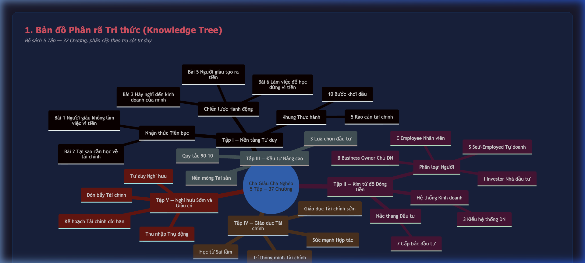
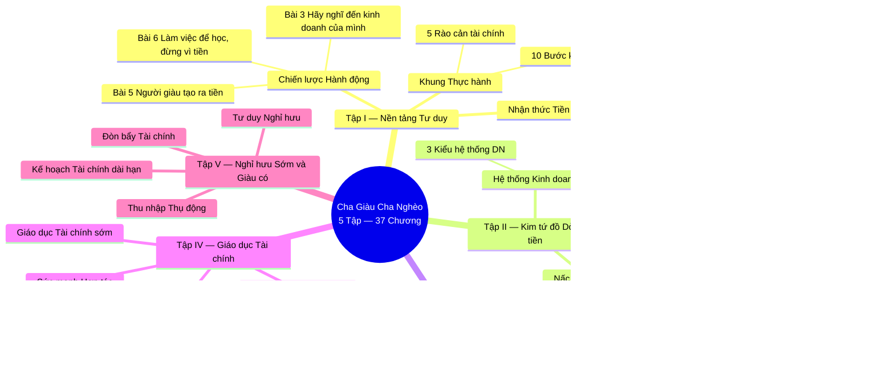
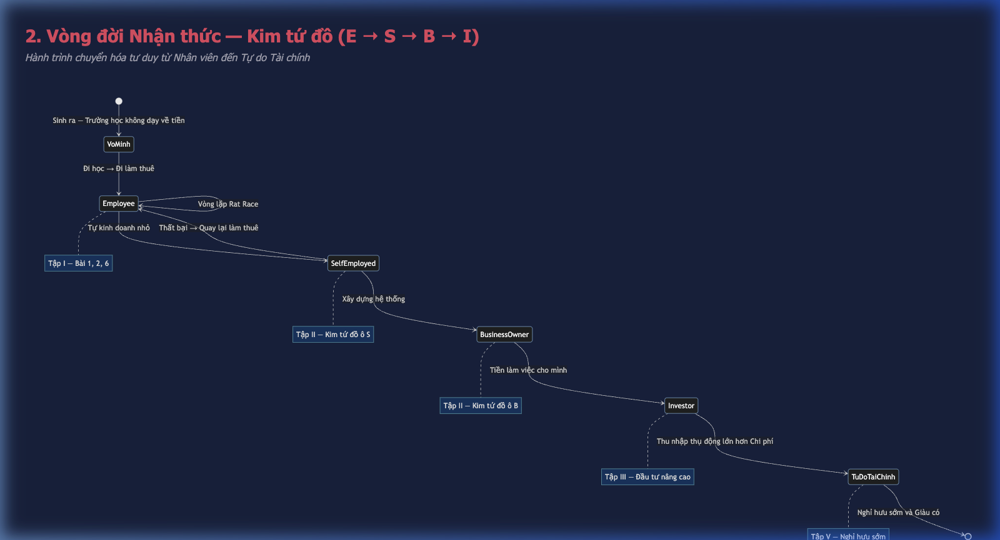
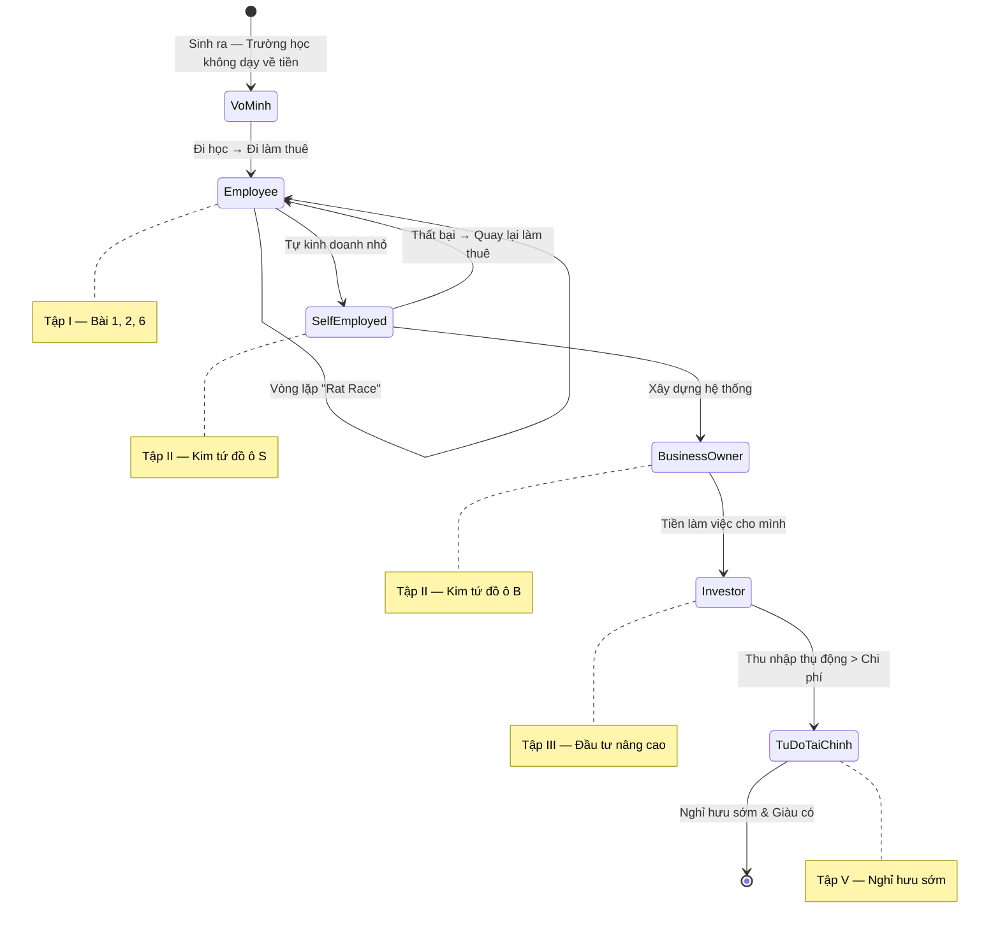
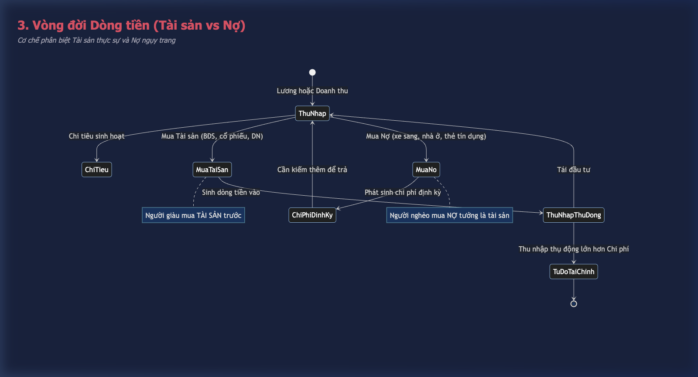
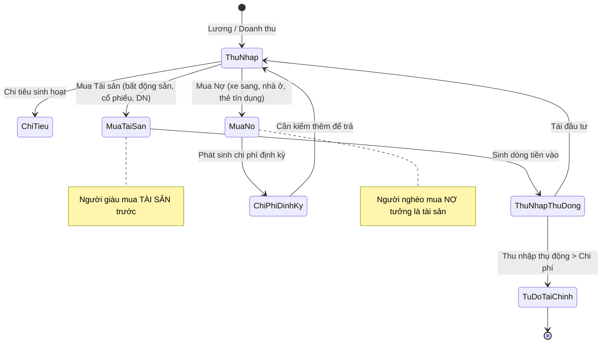
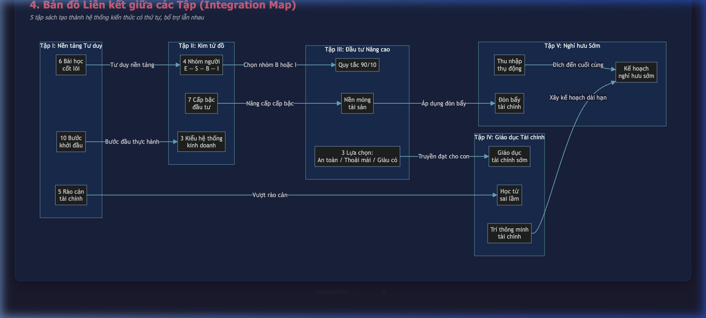
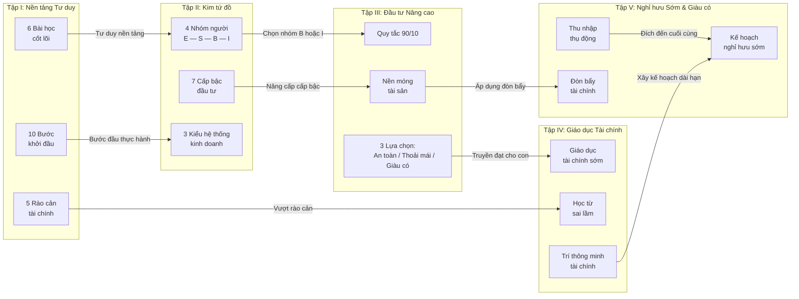

# Cha Giàu Cha Nghèo — Knowledge Architecture & Concept Map

> [!NOTE]
> Tài liệu này tổng hợp cấu trúc tri thức cấp cao (High-level) của bộ sách Cha Giàu Cha Nghèo (5 Tập — 37 Chương), dựa trên phương pháp System Mapping Synthesizer. Giúp bạn nắm được "Bức tranh toàn cảnh" trước khi đi vào chi tiết từng bài học.

## 1. Bản đồ Phân rã Tri thức (Knowledge Tree)

Bộ sách được chia thành 5 tập (Volume), mỗi tập tập trung vào một trụ cột tư duy:

📝 Xem Mermaid source code

## 2. Bản đồ Nhân vật & Vai trò (Character Mapping)

Bộ sách xây dựng xung quanh **2 hình mẫu đối lập** — đây là trục trung tâm của toàn bộ triết lý:

| Nhân vật | Vai trò | Tư duy đại diện | Tập xuất hiện chính |
| --- | --- | --- | --- |
| **Người bố nghèo (Poor Dad)** | Bố ruột Robert. Giáo viên, tiến sĩ giáo dục | Tư duy Nhân viên: "Hãy đi học, lấy bằng, kiếm việc làm ổn định" | Tập I (đối chiếu xuyên suốt) |
| **Người bố giàu (Rich Dad)** | Bố của bạn thân Mike. Doanh nhân không tốt nghiệp cấp 3 | Tư duy Chủ DN / Nhà đầu tư: "Hãy học cách để tiền làm việc cho mình" | Tập I → V (người dẫn dắt) |
| **Robert Kiyosaki** | Tác giả — người kể chuyện, đóng vai người học | Hành trình chuyển đổi từ ô E sang ô B & I trên Kim tứ đồ | Tập I → V |
| **Mike** | Bạn thân Robert, con trai Rich Dad | Minh chứng sống cho giáo dục tài chính sớm | Tập I, II |
| **Kim Kiyosaki** | Vợ Robert, đồng hành trong hành trình tài chính | Từ vô gia cư đến tự do tài chính nhờ bất động sản | Tập IV, V |

> [!TIP]
> Người bố giàu và bố nghèo **không phải 2 người thật đối lập**. Kiyosaki dùng họ như 2 mô hình tư duy (Mental Model) để người đọc tự đối chiếu và chọn con đường. Khi đọc, hãy tập trung vào **sự khác biệt trong cách suy nghĩ về tiền**, không phải câu chuyện cá nhân.

---

## 3. Vòng đời Nhận thức Tài chính (Financial Awareness Lifecycle)

Đây là hành trình chuyển hóa tư duy mà Kiyosaki mô tả xuyên suốt 5 tập. Hiểu vòng đời này giúp bạn biết **mình đang ở giai đoạn nào** và cần đọc tập nào tiếp theo.

### 3.1 Vòng đời Cá nhân trên Kim tứ đồ

> [!IMPORTANT]
> **Quy tắc vàng:** Đa số người mắc kẹt ở giai đoạn `Employee` trong vòng lặp "Rat Race" (Kiếm tiền → Trả nợ → Kiếm thêm tiền). Điểm đột phá là **chuyển từ ô E/S sang ô B/I** — tức là chuyển từ "đổi thời gian lấy tiền" sang "xây hệ thống sinh tiền".

📝 Xem Mermaid source code

### 3.2 Vòng đời Dòng tiền (Tài sản vs Nợ)

📝 Xem Mermaid source code

---

## 4. Bản đồ Liên kết giữa các Tập (Integration Map)

5 tập sách không độc lập. Chúng tạo thành một hệ thống kiến thức có thứ tự, mỗi tập bổ trợ và nâng cấp tập trước:

| Từ Tập | Đến Tập | Mối liên kết | Khái niệm cầu nối |
| --- | --- | --- | --- |
| Tập I | Tập II | Tư duy nền tảng → Phân loại bản thân | Kim tứ đồ E-S-B-I |
| Tập II | Tập III | Chọn ô B/I → Chiến lược đầu tư | Quy tắc 90/10, Nền móng tài sản |
| Tập III | Tập IV | Kinh nghiệm đầu tư → Truyền đạt giáo dục | Giáo dục tài chính sớm |
| Tập III | Tập V | Xây nền tài sản → Đòn bẩy nghỉ hưu | Thu nhập thụ động |
| Tập IV | Tập V | Trí thông minh tài chính → Kế hoạch dài hạn | Nghỉ hưu sớm & giàu có |

> [!TIP]
> **Gợi ý đọc:** Nếu bạn mới bắt đầu, đọc **Tập I → Tập II** trước. Nếu đã có nền tảng kinh doanh, nhảy thẳng đến **Tập III**. Nếu có con nhỏ, **Tập IV** là ưu tiên hàng đầu.

📝 Xem Mermaid source code

---

## 5. Quick Reference: Tra cứu nhanh theo Chủ đề

Bảng tra cứu nhanh khi bạn cần tìm lại một bài học hoặc khái niệm cụ thể:

| Khi bạn muốn tìm hiểu về... | Đọc Tập / Chương | Khái niệm chủ chốt | Mức quan trọng |
| --- | --- | --- | --- |
| Tư duy Giàu vs Nghèo là gì? | Tập I — Ch.1 | 2 mô hình tư duy đối lập | ⭐⭐⭐⭐⭐ |
| Vòng lặp "Rat Race" và cách thoát | Tập I — Ch.2 | Sợ hãi & Tham lam, Tiền làm việc cho mình | ⭐⭐⭐⭐⭐ |
| Phân biệt Tài sản vs Nợ | Tập I — Ch.3 | Dòng tiền vào vs Dòng tiền ra | ⭐⭐⭐⭐⭐ |
| Tại sao cần có doanh nghiệp riêng | Tập I — Ch.4, 5 | Cấu trúc công ty, Ưu đãi thuế | ⭐⭐⭐⭐ |
| Kỹ năng nào cần học | Tập I — Ch.7 | Bán hàng, Marketing, Quản lý | ⭐⭐⭐⭐ |
| 5 rào cản tài chính lớn nhất | Tập I — Ch.8 | Sợ, Nghi ngờ, Lười, Thói quen, Kiêu ngạo | ⭐⭐⭐⭐ |
| Kim tứ đồ E-S-B-I là gì? | Tập II — Ch.1, 2 | 4 nhóm người, 4 cách kiếm tiền | ⭐⭐⭐⭐⭐ |
| 3 kiểu hệ thống kinh doanh | Tập II — Ch.4 | Truyền thống, Nhượng quyền, MLM | ⭐⭐⭐⭐ |
| 7 cấp bậc đầu tư | Tập II — Ch.5 | Từ cấp 0 (không có gì) đến cấp 6 (nhà tư bản) | ⭐⭐⭐⭐⭐ |
| Quy tắc 90/10 trong đầu tư | Tập III — Ch.1, 2 | 10% người nắm 90% tài sản | ⭐⭐⭐⭐ |
| Chiến lược đầu tư An toàn/Thoải mái/Giàu | Tập III — Ch.3, 4 | 3 mức độ rủi ro & phần thưởng | ⭐⭐⭐ |
| Dạy con về tiền bạc | Tập IV — Ch.1, 2 | Giáo dục tài chính trong gia đình | ⭐⭐⭐⭐ |
| Tại sao sai lầm lại có giá trị | Tập IV — Ch.3 | Học từ thất bại, không sợ mắc lỗi | ⭐⭐⭐⭐ |
| Trí thông minh tài chính gồm những gì | Tập IV — Ch.4 | Kế toán, Đầu tư, Thị trường, Luật | ⭐⭐⭐⭐ |
| Thu nhập thụ động & Đòn bẩy | Tập V — Ch.3, 4 | Bất động sản, Cổ tức, Bản quyền | ⭐⭐⭐⭐⭐ |
| Kế hoạch nghỉ hưu sớm cụ thể | Tập V — Ch.1, 2 | Tính toán mốc tự do tài chính | ⭐⭐⭐⭐ |
