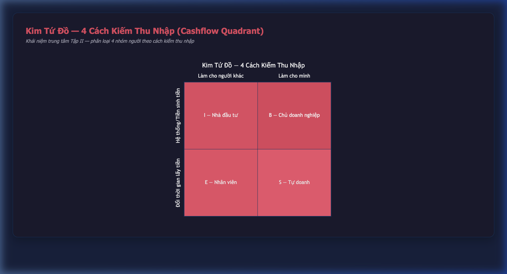
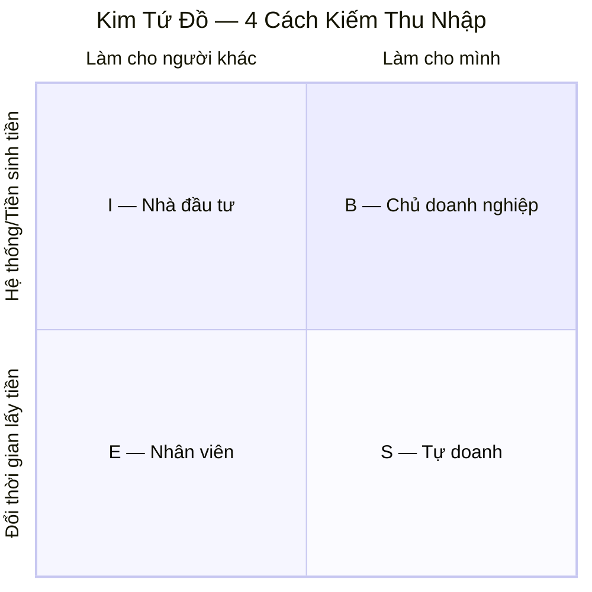

# MA TRẬN KHÁI NIỆM — CHA GIÀU CHA NGHÈO
> Ánh xạ tất cả khái niệm cốt lõi vào một bản đồ duy nhất

---

## 1. Ma trận Tư duy: Bố Nghèo vs Bố Giàu

| Chủ đề | 🔴 Người bố nghèo (Poor Dad) | 🟢 Người bố giàu (Rich Dad) | Tập/Chương |
|--------|-------------------------------|-------------------------------|------------|
| **Tiền bạc** | "Tiền bạc là nguồn gốc của mọi tội lỗi" | "Không có tiền mới là nguồn gốc của mọi tội lỗi" | I/1 |
| **Nhà cửa** | "Nhà là tài sản lớn nhất" | "Nhà là khoản nợ, không phải tài sản" | I/3 |
| **Học hành** | "Học chăm để công ty tốt tuyển dụng" | "Học chăm để mua được công ty tốt" | I/1 |
| **Rủi ro** | "Đừng mạo hiểm" | "Hãy học cách quản lý rủi ro" | I/6 |
| **Thất bại** | "Tránh thất bại bằng mọi giá" | "Thất bại là một phần của quá trình học" | IV/3 |
| **Công việc** | "Kiếm một công việc ổn định" | "Xây dựng hệ thống kinh doanh" | II/1 |
| **Thuế** | "Người giàu nên đóng thuế nhiều hơn" | "Thuế phạt người làm ra tiền, thưởng người chi tiêu" | I/5 |
| **Đầu tư** | "Đầu tư rủi ro, đừng đầu tư" | "Không đầu tư mới rủi ro" | II/5 |
| **Tiết kiệm** | "Hãy tiết kiệm từng đồng" | "Hãy đầu tư từng đồng" | III/1 |
| **Sai lầm** | "Đừng mắc sai lầm" | "Sai lầm giúp con thông minh hơn" | IV/3 |

---

## 2. Khung Kim Tứ Đồ (Cashflow Quadrant)

Đây là khái niệm trung tâm của Tập II, chia mọi người thành 4 nhóm dựa trên cách kiếm thu nhập:



<details>
<summary>📝 Xem Mermaid source code</summary>



</details>

| Nhóm | Tên đầy đủ | Đặc điểm | Câu nói đặc trưng | Mục tiêu |
|------|------------|----------|-------------------|----------|
| **E** | Employee (Nhân viên) | Làm thuê, lương cố định, an toàn | "Tôi cần một công việc ổn định" | An toàn |
| **S** | Self-Employed (Tự doanh) | Tự làm chủ nhưng vẫn đổi thời gian lấy tiền | "Muốn làm tốt, tự mình làm" | Độc lập |
| **B** | Business Owner (Chủ DN) | Sở hữu hệ thống, thuê người vận hành | "Tôi cần người giỏi hơn tôi" | Xây hệ thống |
| **I** | Investor (Nhà đầu tư) | Tiền sinh tiền, thu nhập thụ động | "Tiền làm việc cho tôi" | Tự do |

**Con đường di chuyển được khuyến nghị:** E → S → B → I (hoặc E → B → I)

---

## 3. Công thức cốt lõi: Tài sản vs Nợ

> **Quy tắc vàng (Bài 2 — Tập I Chương 3):** "Tài sản là thứ bỏ tiền vào túi bạn. Nợ là thứ lấy tiền ra khỏi túi bạn."

### Dòng tiền của Người nghèo:
```
Thu nhập (Lương) → Chi phí (100%) → Hết
```

### Dòng tiền của Tầng lớp trung lưu:
```
Thu nhập (Lương) → Nợ (Nhà, Xe, Thẻ tín dụng) → Chi phí → Hết
```

### Dòng tiền của Người giàu:
```
Thu nhập (Lương) → Tài sản (Bất động sản, Cổ phiếu, Kinh doanh)
                         ↓
              Thu nhập thụ động → Tái đầu tư + Chi phí
```

### Phân loại Tài sản vs Nợ:

| Loại | Tài sản (Bỏ tiền vào túi) ✅ | Nợ (Lấy tiền ra khỏi túi) ❌ |
|------|-------------------------------|-------------------------------|
| Bất động sản | Nhà cho thuê sinh dòng tiền | Nhà ở trả góp hàng tháng |
| Phương tiện | — | Xe hơi (mất giá + chi phí bảo dưỡng) |
| Tài chính | Cổ phiếu, trái phiếu, quỹ đầu tư | Thẻ tín dụng tiêu dùng |
| Kinh doanh | Doanh nghiệp không cần có mặt | — |
| Sở hữu trí tuệ | Bản quyền sách, nhạc, bằng sáng chế | — |

---

## 4. Bảng 5 Rào cản Tài chính (Chương 8)

| Số thứ tự | Rào cản | Mô tả | Cách vượt qua (theo tác giả) |
|-----------|---------|-------|------------------------------|
| 1 | **Sự sợ hãi** | Sợ mất tiền, sợ thất bại | Chấp nhận thua lỗ là bài học. "Ai cũng ghét thua, nhưng người thắng cuộc không sợ thua" |
| 2 | **Sự hoài nghi** | Nghe lời cảnh báo từ bạn bè, gia đình, tin tức tiêu cực | Phân tích dữ kiện thay vì nghe cảm xúc. "Gà con chạy quanh la trời sập" |
| 3 | **Sự lười biếng** | Không phải lười thể chất mà lười suy nghĩ về tài chính | Dùng "lòng tham lành mạnh" làm động lực: "Mình sẽ mua được gì nếu làm điều này?" |
| 4 | **Thói quen xấu** | Trả nợ cho người khác trước, trả cho mình sau | "Hãy trả cho mình trước" — tự đặt áp lực buộc mình tìm cách kiếm thêm |
| 5 | **Sự kiêu ngạo** | Dùng sự kiêu ngạo để che đậy sự thiếu hiểu biết | "Điều bạn biết giúp bạn kiếm tiền. Điều bạn không biết khiến bạn mất tiền" |

---

## 5. Bảng 7 Cấp bậc Đầu tư (Tập II Chương 5)

| Cấp | Tên | Đặc điểm | Ví dụ |
|-----|-----|----------|-------|
| 0 | **Không có gì để đầu tư** | Thu nhập bằng hoặc thấp hơn chi phí | Người nợ nần |
| 1 | **Người đi vay** | Giải quyết vấn đề tài chính bằng cách vay mượn | Tiêu dùng bằng thẻ tín dụng |
| 2 | **Người tiết kiệm** | Để dành một khoản nhỏ đều đặn | Gửi tiết kiệm ngân hàng |
| 3 | **Nhà đầu tư thông minh** | Hiểu tại sao cần đầu tư, tham gia quỹ hưu trí, bảo hiểm | Mua quỹ ETF, bảo hiểm nhân thọ |
| 4 | **Nhà đầu tư dài hạn** | Biết cách đầu tư, có chiến lược rõ ràng | Mua bất động sản cho thuê |
| 5 | **Nhà đầu tư tinh vi** | Dùng chiến lược tích cực hơn, chấp nhận rủi ro cao hơn | Đầu tư vào startup, đòn bẩy tài chính |
| 6 | **Nhà đầu tư tư bản** | Tạo ra doanh nghiệp rồi bán cổ phần cho công chúng | Niêm yết công ty trên sàn chứng khoán |

---

## 6. Bảng 10 Bước Khởi Đầu (Chương 9)

| Bước | Nội dung | Hành động cụ thể |
|------|----------|-------------------|
| 1 | Tìm lý do lớn hơn thực tế | Viết ra mục tiêu: "Tôi muốn" và "Tôi không muốn" |
| 2 | Chọn mỗi ngày — sức mạnh của sự lựa chọn | Mỗi đồng tiền tiêu ra là chọn giàu, nghèo hoặc trung lưu |
| 3 | Chọn bạn bè cẩn thận | Kết bạn với người giỏi hơn mình về tài chính |
| 4 | Nắm vững một công thức rồi mới học cái mới | Học sâu một lĩnh vực đầu tư trước khi mở rộng |
| 5 | Tự trả cho mình trước | Dành tiền đầu tư trước khi trả hóa đơn |
| 6 | Trả lương hậu hĩnh cho chuyên gia tư vấn | Thuê luật sư, kế toán, môi giới giỏi |
| 7 | Hãy là "người Ấn Độ cho đi" | Đầu tư với kỳ vọng thu hồi vốn nhanh, rồi tái đầu tư lợi nhuận |
| 8 | Dùng tài sản mua sự xa xỉ | Không mua đồ xa xỉ bằng lương, mà bằng lợi nhuận từ tài sản |
| 9 | Tìm người hùng — tấm gương để noi theo | Học cách Warren Buffett, Peter Lynch, George Soros đầu tư |
| 10 | Dạy và bạn sẽ nhận được | Cho đi kiến thức, tiền bạc sẽ quay lại |

---

## 7. Quy tắc xuyên suốt (Common Rules)

| Mã | Quy tắc | Mô tả | Lặp lại ở |
|----|---------|-------|-----------|
| QT-01 | **Tài sản bỏ tiền vào túi, Nợ lấy tiền ra** | Định nghĩa cốt lõi nhất | Tập I, II, III |
| QT-02 | **Đừng làm việc vì tiền, hãy để tiền làm việc cho bạn** | Triết lý trung tâm | Tập I, II |
| QT-03 | **Trả cho mình trước** | Ưu tiên đầu tư trước chi tiêu | Tập I, II, V |
| QT-04 | **Sai lầm là bài học, không phải thất bại** | Tư duy phát triển | Tập I, IV |
| QT-05 | **Học tập suốt đời về tài chính** | Trường không dạy về tiền | Tập I, III, IV |
| QT-06 | **Di chuyển từ E/S sang B/I** | Mục tiêu Kim tứ đồ | Tập II |
| QT-07 | **Quy tắc 90/10** | 10% người nắm 90% tài sản | Tập III |
