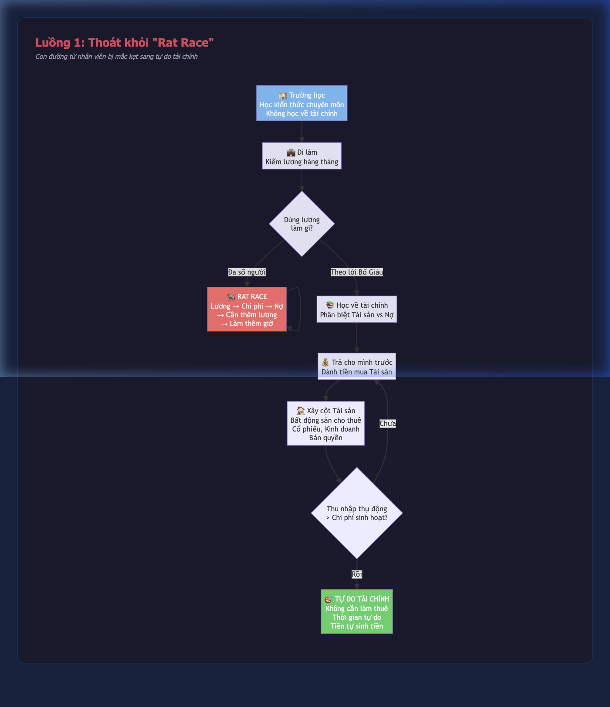
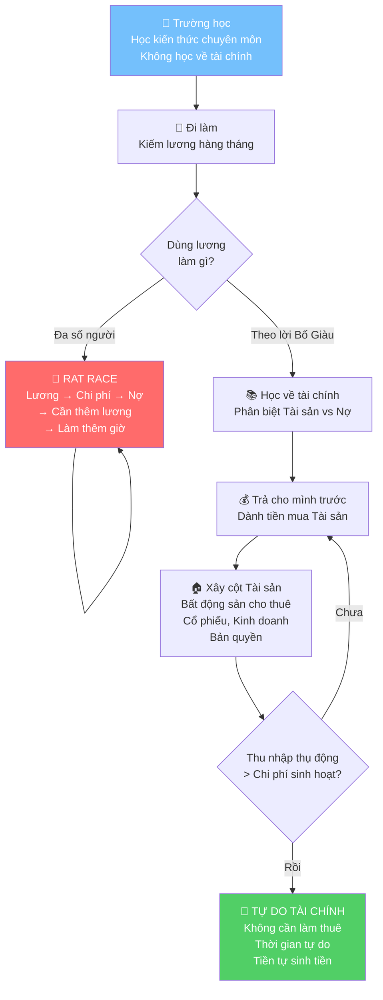
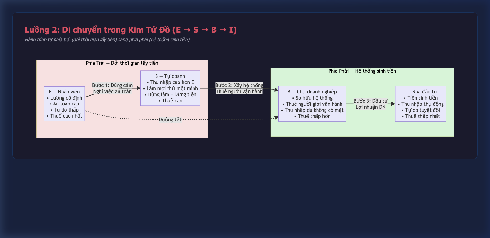
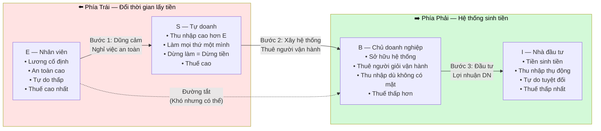
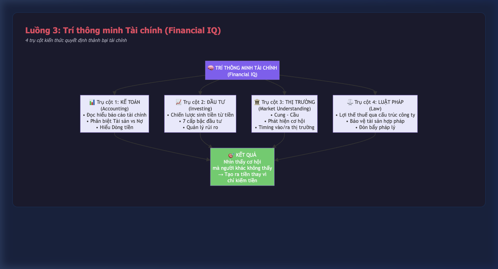
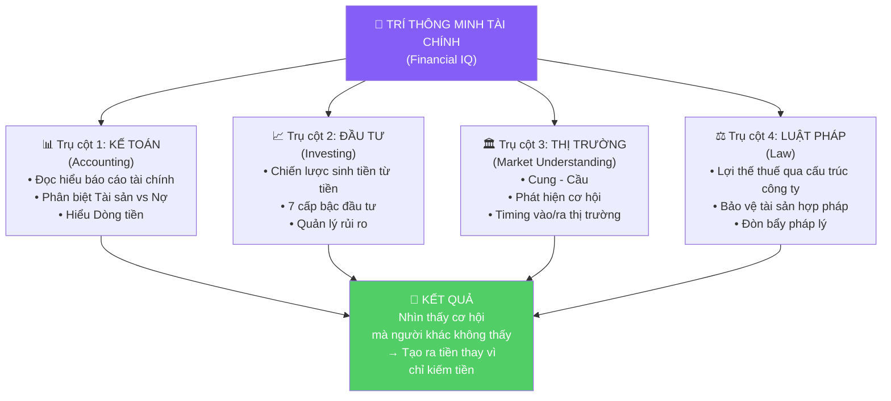
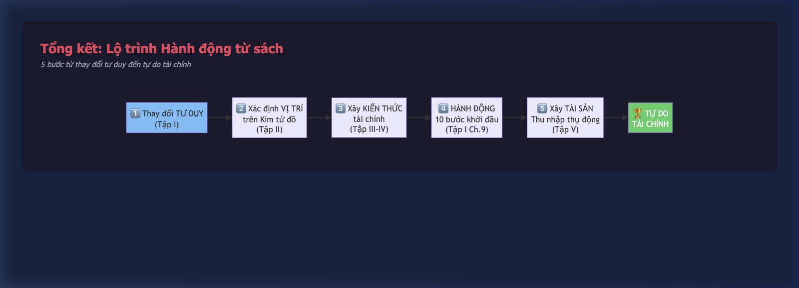
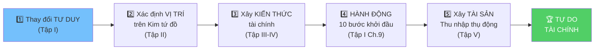

# LUỒNG TƯ DUY CỐT LÕI — CHA GIÀU CHA NGHÈO
> 3 luồng tư duy quan trọng nhất xuyên suốt cuốn sách

---

## Luồng 1: Thoát khỏi "Rat Race" (Vòng xoáy chuột)

**Mô tả:** Đây là luồng chính của Tập I — mô tả con đường từ một nhân viên bình thường bị mắc kẹt trong vòng lặp kiếm-tiêu-nợ sang trạng thái tự do tài chính.

**Tham chiếu:** Tập I, Chương 2-9

📝 Xem Mermaid source code

### Điểm mấu chốt:
1. **Vòng lặp Rat Race** là bẫy mà đa số người mắc phải: kiếm nhiều hơn → tiêu nhiều hơn → nợ nhiều hơn
2. **Chìa khóa thoát** không phải kiếm nhiều tiền hơn, mà là **thay đổi cách dùng tiền** — chuyển từ mua Nợ sang mua Tài sản
3. **Mốc tự do:** Khi thu nhập thụ động từ tài sản vượt qua chi phí sinh hoạt hàng tháng

---

## Luồng 2: Di chuyển trong Kim Tứ Đồ (E → S → B → I)

**Mô tả:** Luồng chính của Tập II — hành trình di chuyển từ phía trái (E, S — đổi thời gian lấy tiền) sang phía phải (B, I — hệ thống và tiền làm việc thay mình).

**Tham chiếu:** Tập II, Chương 1-6

📝 Xem Mermaid source code

### 3 kiểu hệ thống kinh doanh để vào nhóm B:

| Kiểu | Mô tả | Ưu điểm | Nhược điểm |
|------|--------|---------|------------|
| **Tự xây dựng** | Tự tạo doanh nghiệp từ đầu | Tự do sáng tạo, lợi nhuận cao nhất | Rủi ro cao nhất, mất 5-10 năm |
| **Nhượng quyền** | Mua franchise đã có hệ thống | Hệ thống sẵn, rủi ro thấp hơn | Vốn ban đầu lớn, ít tự do |
| **Marketing mạng lưới** | Gia nhập hệ thống sẵn có | Vốn thấp, được đào tạo | Dễ bị hiểu nhầm, đòi hỏi kiên nhẫn |

---

## Luồng 3: Xây dựng Trí thông minh Tài chính (Financial IQ)

**Mô tả:** Luồng xuyên suốt Tập III và IV — 4 trụ cột kiến thức mà trường học không dạy, nhưng quyết định thành bại tài chính.

**Tham chiếu:** Tập I Chương 6, Tập III, Tập IV

📝 Xem Mermaid source code

### Cách phát triển 4 trụ cột:

| Trụ cột | Cách học theo tác giả | Sai lầm thường gặp |
|---------|----------------------|---------------------|
| **Kế toán** | Tham gia khóa học kế toán cơ bản, đọc báo cáo tài chính thực tế | Nghĩ rằng kế toán chỉ dành cho kế toán viên |
| **Đầu tư** | Bắt đầu với số tiền nhỏ, học từ sai lầm thực tế | Giao tiền cho "chuyên gia" mà không hiểu mình đang đầu tư gì |
| **Thị trường** | Đọc tin tức tài chính, quan sát xu hướng kinh tế | Chỉ mua khi giá lên (mua đắt), bán khi giá xuống (bán rẻ) |
| **Luật pháp** | Thuê luật sư giỏi, tìm hiểu cấu trúc công ty | Không thành lập công ty, đóng thuế cá nhân cao |

---

## Tổng kết: Lộ trình Hành động từ sách

📝 Xem Mermaid source code

