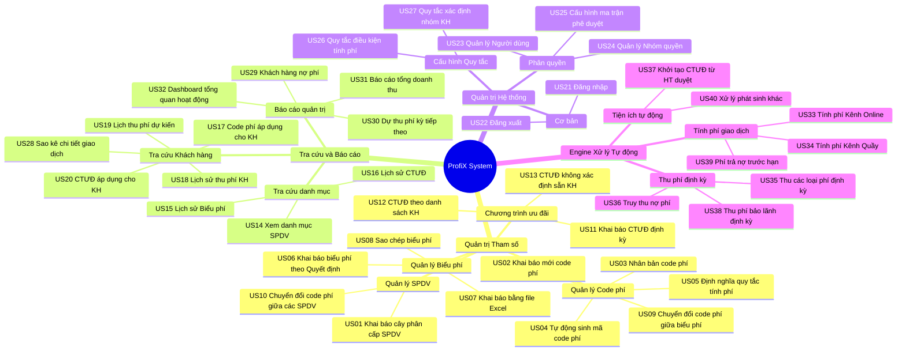
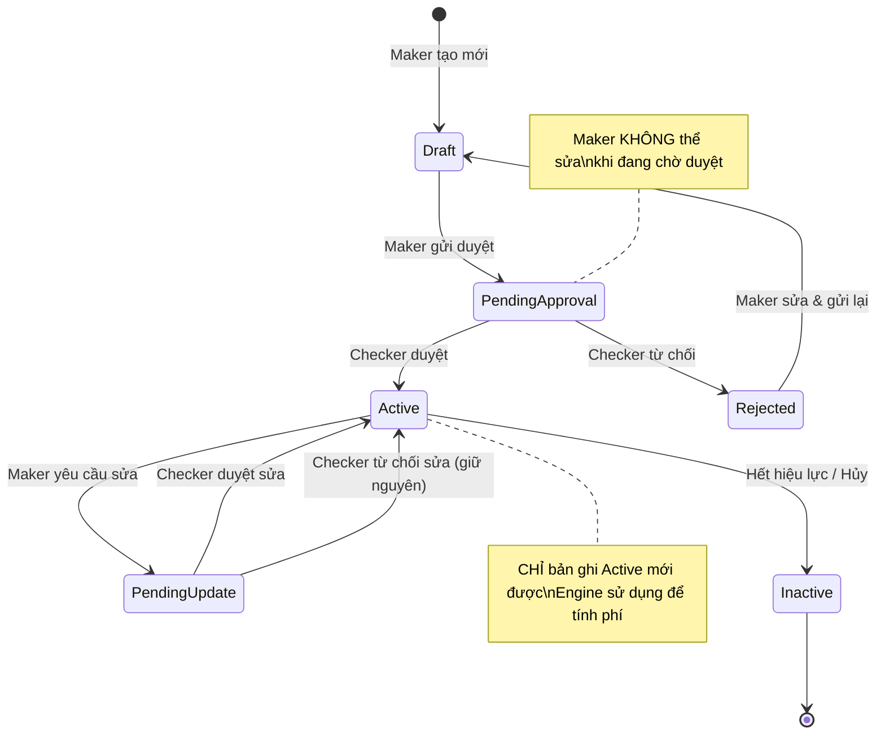
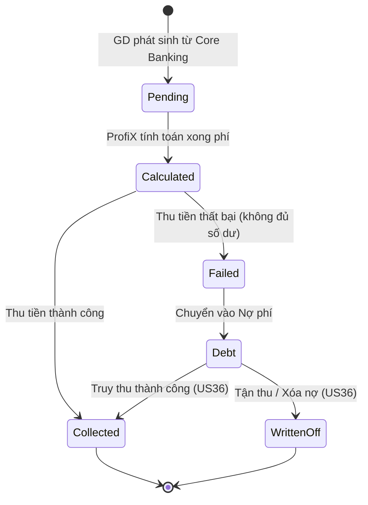
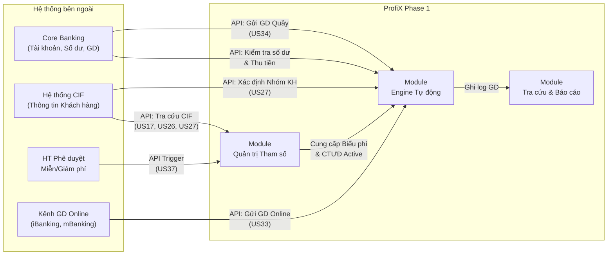

# ProfiX Phase 1 - System Architecture & Feature Map

> [!NOTE]
> Tài liệu này tổng hợp cấu trúc chức năng cấp cao (High-level) của toàn bộ hệ thống ProfiX Phase 1, dựa trên 40 User Stories. Giúp bạn nắm được "Bức tranh toàn cảnh" trước khi đi vào chi tiết nghiệp vụ.

## 1. Bản đồ Phân rã Chức năng (Feature Tree)

Hệ thống được chia thành 4 phân hệ (Module) cốt lõi:

## 2. Bản đồ Người dùng & Phân quyền (Role Mapping)

Dựa trên các User Stories, hệ thống có 3 nhóm đối tượng (Actors) chính:

| Actor | Vai trò | Các Module tiếp cận |
| --- | --- | --- |
| **Quản trị viên (System Admin)** | Quản lý hệ thống, phân quyền và thiết lập các quy tắc nền tảng. | - Quản trị Hệ thống (US21-US27) |
| **Người dùng Khai báo (Maker/Checker)** | Nhân viên nghiệp vụ thực hiện thiết lập cấu hình phí, biểu phí, khuyến mãi. Cần tuân thủ ma trận phê duyệt (US25). | - Quản trị Tham số (US01-US13) - Tra cứu & Báo cáo |
| **Hệ thống lõi (Core Engine / Batch)** | Xử lý các tác vụ ngầm định, tính toán và thu phí dựa trên quy tắc đã cấu hình. | - Engine xử lý tự động (US33-US40) |

> [!TIP]
> Các User Story từ US33 đến US40 thuộc dạng **System Cases** (hệ thống tự chạy ngầm). Khi tiếp cận nhóm này để viết Test Case hoặc tích hợp, bạn cần tập trung vào việc kích hoạt (trigger) các tiến trình Batch/Cronjob hoặc API giả lập các giao dịch từ hệ thống ngoài (Core Banking) đổ về.

---

## 3. Vòng đời Trạng thái (State Lifecycle) — BỔ SUNG

Hầu hết các đối tượng cốt lõi trong ProfiX đều tuân thủ chu trình trạng thái (State) Maker-Checker. Hiểu vòng đời này giúp bạn biết **tại bước nào thì dữ liệu có hiệu lực**, từ đó viết Test Case chính xác hơn.

### 3.1 Vòng đời Code phí / Biểu phí / CTƯĐ

> [!IMPORTANT]
> **Quy tắc vàng:** Engine tự động (US33-US40) **CHỈ ĐƯỢC** đọc các bản ghi có trạng thái `Active`. Nếu Code phí đang `Draft`, `PendingApproval`, hoặc `Inactive` thì Engine phải bỏ qua, không được dùng để tính phí cho khách hàng.

### 3.2 Vòng đời Giao dịch Thu phí

---

## 4. Bản đồ Tích hợp Hệ thống Ngoài (Integration Map) — BỔ SUNG

ProfiX không hoạt động độc lập. Nó giao tiếp với nhiều hệ thống bên ngoài. Hiểu rõ các "cửa giao tiếp" này cực kỳ quan trọng để test tích hợp (Integration Testing).

| Hệ thống ngoài | Giao tiếp với Module | Mục đích | User Stories |
| --- | --- | --- | --- |
| Core Banking | Engine Tự động | Nhận GD quầy, kiểm tra số dư, thu tiền | US34, US35, US36, US38 |
| Kênh Online | Engine Tự động | Nhận GD online realtime | US33 |
| Hệ thống CIF | Quản trị Tham số + Engine | Tra cứu thông tin KH, xác định nhóm KH | US17, US26, US27 |
| HT Phê duyệt Miễn/Giảm phí | Quản trị Tham số | Tự động khởi tạo CTƯĐ từ kết quả duyệt | US37 |

---

## 5. Quick Reference: Đọc tài liệu FSD theo Module — BỔ SUNG

Bảng tra cứu nhanh khi bạn cần đọc lại chi tiết FSD gốc cho một chức năng cụ thể:

| Khi bạn muốn tìm hiểu về... | Đọc các US | Nhóm Module |
| --- | --- | --- |
| Cây sản phẩm dịch vụ (SPDV) là gì? | US01, US14 | Quản trị Tham số |
| Code phí được tạo và cấu hình ra sao? | US02, US03, US04, US05 | Quản trị Tham số |
| Biểu phí là gì, tạo/sao chép thế nào? | US06, US07, US08, US09, US10, US15 | Quản trị Tham số |
| Chương trình ưu đãi hoạt động ra sao? | US11, US12, US13, US16, US20, US37 | Quản trị Tham số + Engine |
| Phân quyền & phê duyệt | US21-US25 | Quản trị Hệ thống |
| Quy tắc nền (điều kiện phí, nhóm KH) | US26, US27 | Quản trị Hệ thống |
| Tra cứu thông tin khách hàng | US17, US18, US19, US20, US28 | Tra cứu |
| Báo cáo quản trị | US29, US30, US31, US32 | Báo cáo |
| Tính phí tự động (realtime) | US33, US34, US39 | Engine |
| Thu phí định kỳ & truy thu nợ (batch) | US35, US36, US38, US40 | Engine |
| Quy tắc chung UI (Search, Filter, Paging) | Phụ lục FSD | Áp dụng toàn hệ thống |
