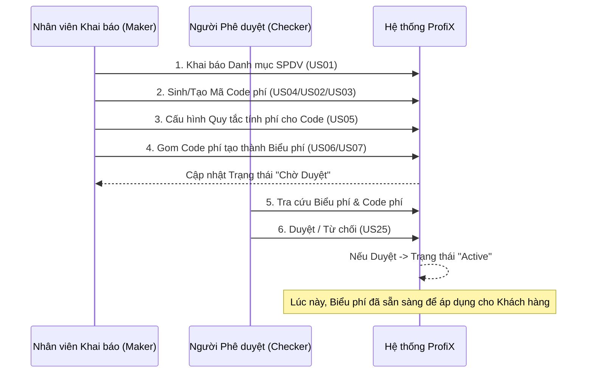
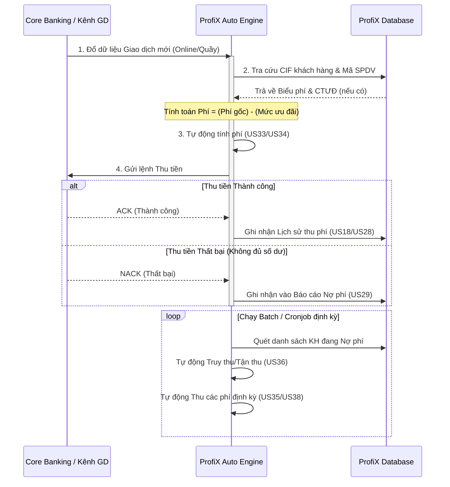

# ProfiX Phase 1 - Core Business Workflows

> [!NOTE]
> Tài liệu này xâu chuỗi các User Stories rời rạc thành 3 luồng nghiệp vụ (Business Flows) cốt lõi của hệ thống ProfiX Phase 1. Việc nhìn hệ thống theo "dòng chảy" sẽ giúp bạn dễ dàng viết Test Case Integration hoặc End-to-End.

## 1. Flow 1: Khởi tạo và Cấu hình Biểu phí (Fee Setup Workflow)
Đây là luồng hoạt động đầu tiên phải làm khi vận hành hệ thống.



## 2. Flow 2: Khởi tạo Chương trình Ưu đãi (Promotion Setup Workflow)
CTƯĐ có thể được tạo bằng tay bởi Maker, hoặc tự động kích hoạt (trigger) từ một hệ thống bên ngoài.

```mermaid
flowchart TD
    A[Bắt đầu] --> B{Nguồn khởi tạo}
    
    B -->|Tự động| C[Hệ thống Miễn giảm phí khác]
    C -->|API Trigger (US37)| D[ProfiX: Tự động khởi tạo CTƯĐ]
    
    B -->|Thủ công| E[Nhân viên Khai báo]
    E --> F[Khai báo CTƯĐ định kỳ - US11]
    E --> G[Khai báo CTƯĐ theo DS KH - US12]
    E --> H[Khai báo CTƯĐ mở - US13]
    
    F --> I((Chờ Phê Duyệt - US25))
    G --> I
    H --> I
    D --> I
    
    I -->|Checker Duyệt| J[Trạng thái Active]
    J --> K[Sẵn sàng áp dụng ưu đãi]
```

## 3. Flow 3: Luồng Xử lý Giao dịch & Auto Billing (Core Engine Workflow)
Đây là "trái tim" của ProfiX. Khi có một giao dịch phát sinh từ Kênh Online hoặc Quầy, ProfiX sẽ tự động hứng, tính toán phí, trừ ưu đãi, và thu tiền.



### Các rủi ro (Loopholes) cần lưu ý khi review luồng này:
1. **Flow 3 (Auto Billing):** Cần làm rõ xử lý ngoại lệ khi Core Banking bị timeout không trả về ACK/NACK. Cơ chế retry (thử lại) thu tiền của ProfiX hoạt động như thế nào?
2. **Flow 3 (Truy thu - US36):** Việc quét nợ chạy tần suất bao lâu 1 lần (realtime, theo ngày, hay cuối tháng)? Điều này cực kỳ quan trọng để test hiệu năng.
3. **Mâu thuẫn giá trị:** Nếu Khách hàng thỏa mãn đồng thời 2 CTƯĐ (Ví dụ: Ưu đãi 1 từ US11, Ưu đãi 2 từ US12), hệ thống sẽ chọn ưu đãi nào để trừ? Cần hỏi BA.
