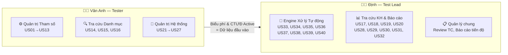
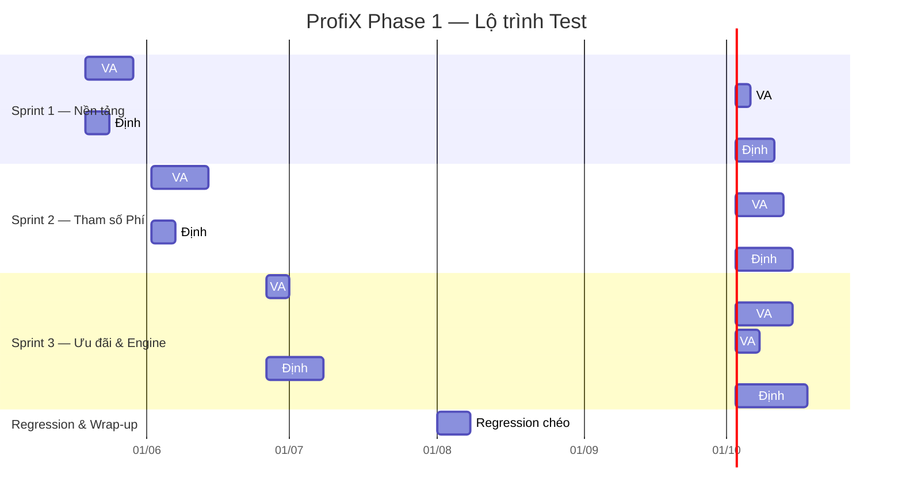

# TEST PLAN — ProfiX Phase 1
### Hệ thống Quản lý Tham số Phí Dịch vụ

| Thông tin | Chi tiết |
|-----------|----------|
| **Dự án** | ProfiX Phase 1 |
| **Tài liệu tham chiếu** | FSD_ProfiX Phase 1_ver 0.1 |
| **Ngày lập** | 14/05/2026 |
| **Người lập** | Định (Test Lead) |
| **Phiên bản** | 1.0 |

---

## 1. Phạm vi Kiểm thử (Test Scope)

### 1.1 Trong phạm vi (In Scope)

| # | Module | User Stories | Mô tả |
|---|--------|-------------|--------|
| 1 | Quản trị Tham số | US01 → US13 | Khai báo SPDV, Code phí, Biểu phí, CTƯĐ |
| 2 | Tra cứu & Báo cáo | US14 → US20, US28 → US32 | Tra cứu danh mục, KH, Sao kê, Dashboard |
| 3 | Quản trị Hệ thống | US21 → US27 | Đăng nhập, Phân quyền, Quy tắc nền |
| 4 | Engine Xử lý Tự động | US33 → US40 | Tính phí, Thu phí định kỳ, Truy thu |

**Tổng:** 40 User Stories

### 1.2 Ngoài phạm vi (Out of Scope)
- Performance Testing / Load Testing (chưa có NFR cụ thể từ BA)
- Security Penetration Testing (do đội Security riêng thực hiện)
- UAT (User Acceptance Testing — do Business thực hiện)

---

## 2. Chiến lược Kiểm thử (Test Strategy)

### 2.1 Các cấp độ test

| Cấp độ | Áp dụng cho | Phương pháp |
|--------|------------|-------------|
| **Functional Testing** | Tất cả 40 US | Black-box: Equivalence Partitioning, BVA, State Transition |
| **Integration Testing** | Liên kết giữa các Module | Kiểm tra luồng E2E: Khai báo → Duyệt → Engine tính phí |
| **API Testing** | US33-US40, US37 | Postman / Script tự động — validate request/response |
| **Regression Testing** | Sau mỗi Sprint | Chạy lại bộ TC critical của Sprint trước |

### 2.2 Môi trường test

| Môi trường | Mục đích |
|-----------|----------|
| SIT (System Integration Test) | Test chức năng + tích hợp nội bộ |
| UAT (User Acceptance Test) | Business验 xác nhận nghiệp vụ (ngoài scope team) |

---

## 3. Phân công Nhân sự

### 3.1 Chi tiết phân công — Định (Test Lead)

**Vai trò kép:** Vừa test trực tiếp, vừa quản lý chất lượng chung.

| Nhóm | User Stories | SL | Loại Test | Độ phức tạp |
|------|-------------|:--:|-----------|:-----------:|
| Tính phí GD Online/Quầy | US33, US34, US39 | 3 | API + Data Validation | ⭐⭐⭐⭐⭐ |
| Thu phí định kỳ & Truy thu | US35, US36, US38, US40 | 4 | Batch/Job + API | ⭐⭐⭐⭐⭐ |
| Khởi tạo CTƯĐ tự động | US37 | 1 | Integration API | ⭐⭐⭐ |
| Tra cứu theo KH | US17, US18, US19, US20, US28 | 5 | UI + Data Accuracy | ⭐⭐ |
| Báo cáo quản trị | US29, US30, US31, US32 | 4 | UI + Data Accuracy | ⭐⭐⭐ |
| **Tổng** | | **17** | | |

**Trách nhiệm bổ sung (Lead):**
- Review chéo Test Case của Vân Anh
- Tổng hợp báo cáo tiến độ / defect hàng tuần
- Quyết định entry/exit criteria cho từng Sprint
- Phối hợp với BA để clarify Q&A (Part B)

### 3.2 Chi tiết phân công — Vân Anh (Tester)

| Nhóm | User Stories | SL | Loại Test | Độ phức tạp |
|------|-------------|:--:|-----------|:-----------:|
| Quản lý SPDV | US01, US10 | 2 | UI + State | ⭐⭐ |
| Quản lý Code phí | US02, US03, US04, US05, US09 | 5 | UI + Form + Logic | ⭐⭐⭐ |
| Quản lý Biểu phí | US06, US07, US08 | 3 | UI + Import/Export | ⭐⭐⭐ |
| Chương trình Ưu đãi | US11, US12, US13 | 3 | UI + Business Logic | ⭐⭐⭐⭐ |
| Tra cứu Danh mục | US14, US15, US16 | 3 | UI + Filter/Search | ⭐ |
| Đăng nhập/Đăng xuất | US21, US22 | 2 | UI + Session | ⭐ |
| Phân quyền & Quy tắc | US23, US24, US25, US26, US27 | 5 | UI + RBAC Logic | ⭐⭐⭐ |
| **Tổng** | | **23** | | |

---

## 4. Lộ trình Thực hiện (Sprint Plan)

> [!WARNING]
> **Phụ thuộc chéo:** Định **không thể** bắt đầu test US33-US40 (Engine) cho đến khi Vân Anh hoàn thành tạo dữ liệu Biểu phí + CTƯĐ Active ở Sprint 2. Trong thời gian chờ, Định tập trung test Tra cứu KH + Báo cáo (ít phụ thuộc).

---

## 5. Tiêu chí Bắt đầu / Kết thúc (Entry / Exit Criteria)

### Entry Criteria (Điều kiện bắt đầu test)
- [x] Tài liệu FSD đã được review và phê duyệt
- [ ] Môi trường SIT đã sẵn sàng, deploy bản build ổn định
- [ ] Test Data cơ bản đã được chuẩn bị (CIF mẫu, SPDV mẫu)
- [ ] Tài khoản test (Admin, Maker, Checker) đã được cấp

### Exit Criteria (Điều kiện kết thúc test)
- [ ] 100% Test Case đã được thực thi
- [ ] Không còn bug Severity **Critical** hoặc **High** ở trạng thái Open
- [ ] Bug Severity **Medium** còn mở ≤ 5
- [ ] Regression Test pass rate ≥ 95%
- [ ] Báo cáo Test Summary đã được Định ký duyệt

---

## 6. Quản lý Rủi ro

| # | Rủi ro | Xác suất | Ảnh hưởng | Giải pháp |
|---|--------|:--------:|:---------:|-----------|
| R1 | Tài liệu FSD thay đổi giữa chừng | Cao | Cao | Tracking version FSD, cập nhật TC kịp thời |
| R2 | Môi trường SIT không ổn định | TB | Cao | Phối hợp Dev fix sớm, có fallback plan test local |
| R3 | API Core Banking chưa sẵn sàng | Cao | Cao | Dùng Mock API cho US33-US40 ở giai đoạn đầu |
| R4 | Vân Anh cần thời gian ramp-up nghiệp vụ phí | TB | TB | Định hỗ trợ KT (Knowledge Transfer) tuần đầu |
| R5 | Khối lượng TC cho Engine (US33-US40) quá lớn | TB | Cao | Ưu tiên Happy Path + Critical Negative trước |

---

## 7. Quy tắc Phối hợp Hàng ngày

| Hoạt động | Tần suất | Người thực hiện |
|-----------|----------|-----------------|
| Daily Standup (15 phút) | Hàng ngày | Định + Vân Anh |
| Review chéo Test Case | Cuối mỗi nhóm US | Định review TC của VA, VA review TC Engine của Định |
| Sync Q&A với BA | Khi có Part B mới | Định tổng hợp & gửi |
| Báo cáo tiến độ tuần | Thứ 6 hàng tuần | Định |
| Retrospective | Cuối mỗi Sprint | Định + Vân Anh |

---

## 8. Deliverables (Sản phẩm bàn giao)

| # | Sản phẩm | Người chịu trách nhiệm | Thời điểm |
|---|----------|------------------------|-----------|
| 1 | Test Plan (tài liệu này) | Định | Trước khi bắt đầu |
| 2 | Part A — Business Summary (mỗi US) | Định + Vân Anh (theo phân công) | Trước khi viết TC |
| 3 | Part B — Q&A / Gap Analysis (mỗi US) | Định + Vân Anh (theo phân công) | Trước khi viết TC |
| 4 | Test Cases (.xlsx) | Định + Vân Anh (theo phân công) | Theo lộ trình Sprint |
| 5 | Defect Report | Định + Vân Anh | Liên tục |
| 6 | Test Summary Report | Định | Cuối dự án |
