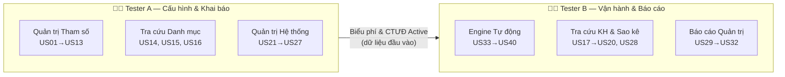

# ProfiX Phase 1 — Phân chia công việc cho 2 Testers

## Nguyên tắc chia việc

Thay vì chia ngẫu nhiên (ví dụ: Tester A làm US01-US20, Tester B làm US21-US40), tôi đề xuất chia theo **luồng nghiệp vụ (Flow-based)** vì:

1. **Giảm thời gian đọc hiểu:** Mỗi tester chỉ cần nắm sâu 1 nửa hệ thống thay vì cả 2 phải đọc hết 300 trang.
2. **Giảm xung đột dữ liệu test:** Các US trong cùng luồng chia sẻ test data → 1 người quản lý sẽ nhất quán hơn.
3. **Dễ review chéo:** Khi review, mỗi người chỉ cần hiểu bối cảnh "luồng kia" ở mức tổng quan.

---

## Phương án đề xuất



---

## Chi tiết phân bổ

### 🧑‍💻 Tester A — Nhóm "Cấu hình & Khai báo" (23 US)

**Trọng tâm:** Toàn bộ thao tác **thủ công** trên giao diện — tạo, sửa, duyệt, phân quyền.

| Nhóm | User Stories | Số lượng | Độ phức tạp |
|------|-------------|:--------:|:-----------:|
| Quản lý SPDV | US01, US10 | 2 | ⭐⭐ |
| Quản lý Code phí | US02, US03, US04, US05, US09 | 5 | ⭐⭐⭐ |
| Quản lý Biểu phí | US06, US07, US08 | 3 | ⭐⭐⭐ |
| Chương trình Ưu đãi | US11, US12, US13 | 3 | ⭐⭐⭐⭐ |
| Tra cứu Danh mục | US14, US15, US16 | 3 | ⭐ |
| Đăng nhập/Đăng xuất | US21, US22 | 2 | ⭐ |
| Phân quyền & Quy tắc | US23, US24, US25, US26, US27 | 5 | ⭐⭐⭐ |

**Yêu cầu kỹ năng:** Mạnh về UI Testing, Form Validation, State Transition (trạng thái Maker-Checker).

### 🧑‍💻 Tester B — Nhóm "Vận hành & Báo cáo" (17 US)

**Trọng tâm:** Các luồng chạy **tự động ngầm** (Engine/Batch) và **đọc/xuất dữ liệu** (Báo cáo).

| Nhóm | User Stories | Số lượng | Độ phức tạp |
|------|-------------|:--------:|:-----------:|
| Tính phí GD (Online/Quầy) | US33, US34, US39 | 3 | ⭐⭐⭐⭐⭐ |
| Thu phí định kỳ & Truy thu | US35, US36, US38, US40 | 4 | ⭐⭐⭐⭐⭐ |
| Khởi tạo CTƯĐ tự động | US37 | 1 | ⭐⭐⭐ |
| Tra cứu theo KH | US17, US18, US19, US20, US28 | 5 | ⭐⭐ |
| Báo cáo quản trị | US29, US30, US31, US32 | 4 | ⭐⭐⭐ |

**Yêu cầu kỹ năng:** Mạnh về API Testing, Batch/Job Testing, Data Validation (kiểm tra tính chính xác số liệu phí, báo cáo).

---

## Phân tích Cân bằng Tải (Workload Balance)

| Tiêu chí | Tester A | Tester B | Đánh giá |
|----------|:--------:|:--------:|----------|
| Số lượng US | 23 | 17 | A nhiều hơn số lượng... |
| Độ phức tạp trung bình | ⭐⭐~⭐⭐⭐ | ⭐⭐⭐~⭐⭐⭐⭐⭐ | ...nhưng B phức tạp hơn nhiều |
| Loại test chính | UI + Form + State | API + Batch + Data | Cân bằng kỹ năng |
| Phụ thuộc chéo | Ít (nguồn gốc dữ liệu) | Cao (phụ thuộc data từ A) | ⚠️ Cần phối hợp |

> [!IMPORTANT]
> **Điểm mấu chốt:** Tester A phải **hoàn thành khai báo dữ liệu test** (Code phí, Biểu phí, CTƯĐ Active) **TRƯỚC** khi Tester B bắt đầu test Engine tự động. Nếu không, B sẽ không có dữ liệu đầu vào để test.

---

## Quy tắc Phối hợp

### 1. Thứ tự triển khai theo Sprint

```
Sprint 1: Tester A làm US21-US27 (Phân quyền) + US01 (SPDV)
           Tester B chuẩn bị Test Data + đọc hiểu US33-US40

Sprint 2: Tester A làm US02-US08 (Code phí & Biểu phí)
           Tester B làm US17-US20, US28 (Tra cứu KH — ít phụ thuộc)

Sprint 3: Tester A làm US09-US13 (Chuyển đổi, Ưu đãi) + US14-US16
           Tester B làm US33-US40 (Engine) + US29-US32 (Báo cáo)
           → Lúc này data từ A đã sẵn sàng cho B
```

### 2. Review chéo (Cross Review)
- Tester A review Test Case của Tester B về phần **Engine** (vì A hiểu cấu hình đầu vào).
- Tester B review Test Case của Tester A về phần **Ưu đãi** (vì B hiểu cách Engine tiêu thụ CTƯĐ).

### 3. Shared Knowledge
Cả 2 tester đều PHẢI nắm chung:
- **Common Rules** (Phụ lục FSD): Tìm kiếm, Lọc, Phân trang, Upload file → xem [ProfiX_Business_Matrix.md](file:///Users/mac/.gemini/antigravity/brain/2a3150ef-63b7-46f0-a40a-2df38f2f86f6/ProfiX_Business_Matrix.md)
- **State Lifecycle** (Vòng đời Maker-Checker) → xem [ProfiX_System_Architecture.md](file:///Users/mac/.gemini/antigravity/brain/2a3150ef-63b7-46f0-a40a-2df38f2f86f6/ProfiX_System_Architecture.md) mục 3
